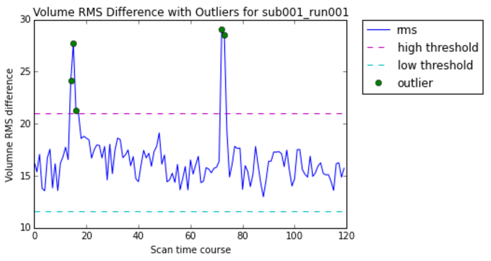
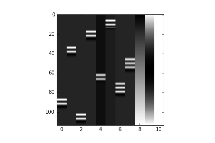
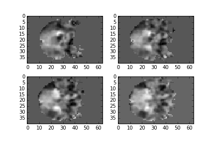
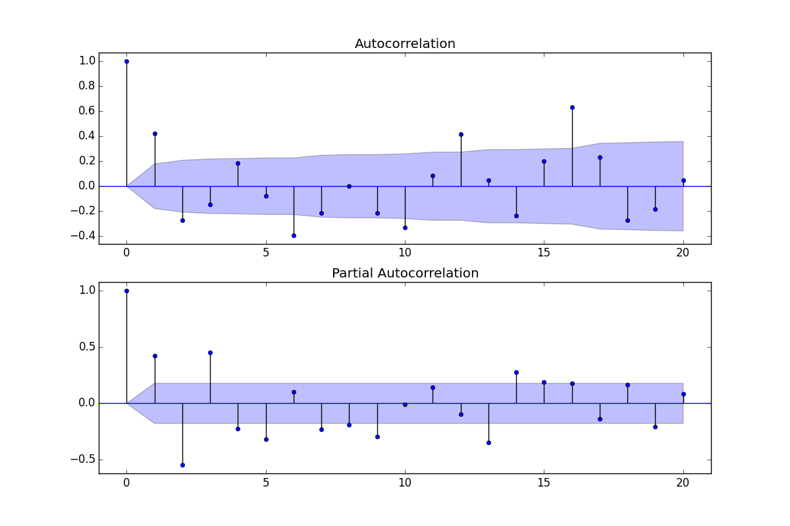
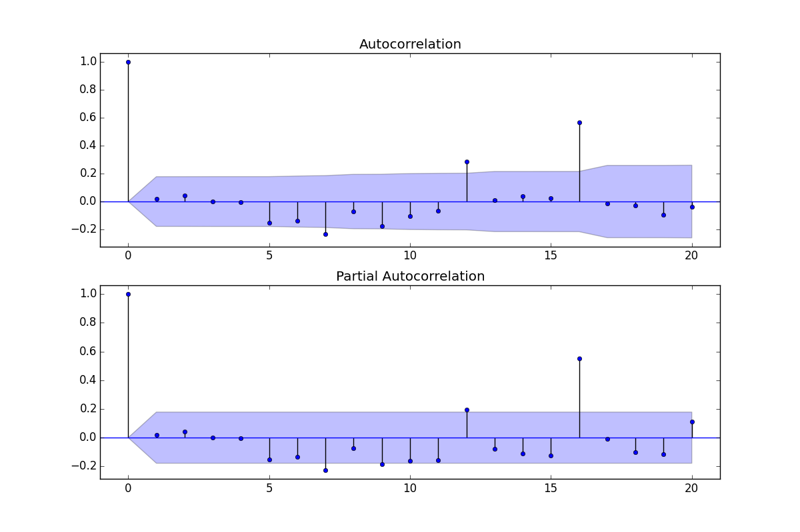
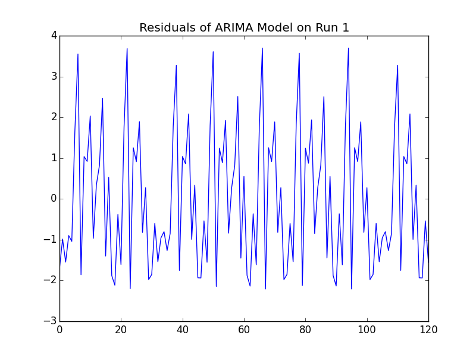
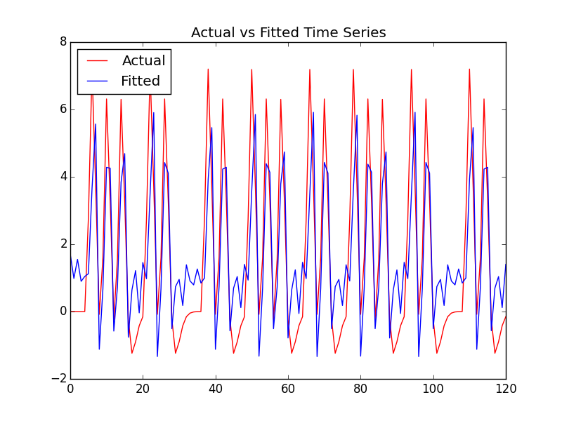

% Project Zeta Final Report
% Tzu-Chieh Chen, Edith Ho, Zubair Marediya, Mike Tran, Dongping Zhang
% December 3, 2015

# Background

## The Paper

- 'Distributed and Overlapping Representations of Faces and Objects in Ventral Temporal Cortex'
- from OpenFMRI.org
- ds105

## The Data

- 6 subjects
- 12 runs per subject
- 8 conditions per run: faces, houses, cats, scissors, bottles, chairs, scrambledpix, shoes

## The Method

- Linear regression (Lasso/Ridge/Elastic Net)
- T-tests
- Convolution
- Smoothing

# Initial work

## Our Hypothesis
- The differences of BOLD signals between different conditions are significant

## Exploratory Data Analysis

- Downloaded data
- Initial analysis: Sub001 Run001
- Identified and removed outliers (with functions from HW2)
- Attempted to test our hypothesis
- Convolution and prediction of BOLD signals
- Created design matrix for linear regression

## Identify outliers

## Task time course - Event related design

## Convolution Graphs
 

## Design Matrix
- bottle, cat, chair, face, house, scissors, scrambledpix, shoe, drift1, drift2, ones

## Problems Faced

- Noise within original dataset, causing low-resolution brain images
- Drifting of BOLD signals
- Standardization of BOLD signals across different subjects for comparison
- Difficulty understanding the study and the dataset itself
- Hence only did analysis on one subject and one run so far

## Before And After Smoothing
- Background noise is high:

## Before And After Smoothing
- Before Smoothing:

## Before And After Smoothing
- Used smoothing techniques to create clearer and more meaningful images

## Before And After Smoothing
- We can identify brain region specific for stimulation

## Before And After Smoothing
- Detail:

## Masking
- wrote helper function to create masks for useful brain areas
- 80th percentile cutoff for intensities

## Affining
- took masked to voxel coordinates and tracked them through different runs
- helped us properly correlate intensities

## Correlation
- correlation between:
- run1 house vs run2 house = 0.50060026
- run1 house vs run2 face = 0.76080714
- run1 house vs run3 house = 0.82295125
- run1 house vs run3 face = 0.64401008
- run2 house vs run4 house = 0.52813216
- run2 house vs run4 face = 0.23481469

- all odds house vs all even face = -0.05986216
- all odd house vs all even house = 1

- correlation highest when comparing same object

## Time Series
- ARIMA model, parameters = 1.70360618, -0.05272599, -0.53091966, 1.06627208, 0.63106367

