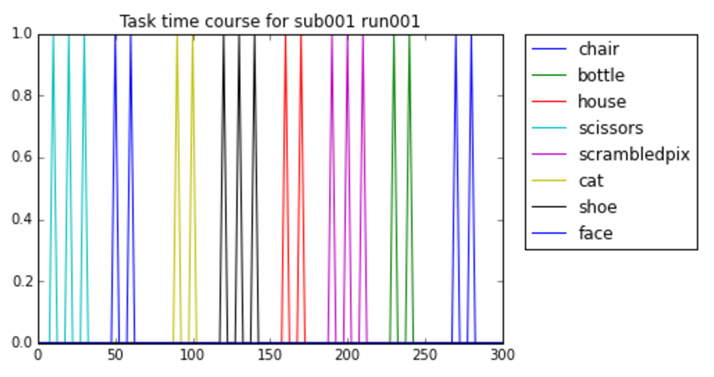
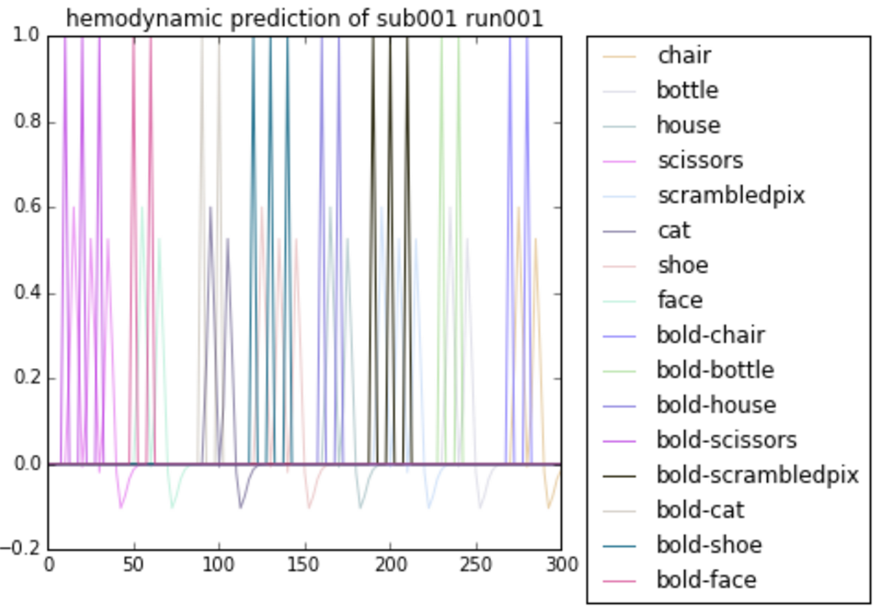
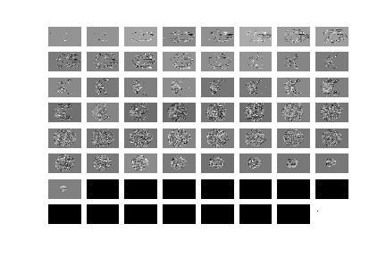
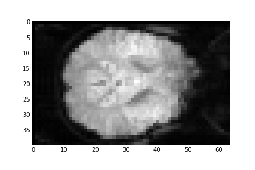
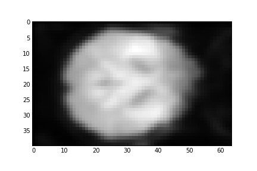
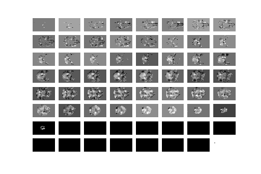

% Project Zeta Progress Report
% Tzu-Chieh Chen, Edith Ho, Zubair Marediya, Mike Tran, Dongping Zhang
% November 12, 2015

# Background

## The Paper

- 'Distributed and Overlapping Representations of Faces and Objects in VEntral Temporal Cortex'
- from OpenFMRI.org
- ds105

## The Data

- 6 subjects
- 12 runs per subject
- 8 conditions per run: faces, houses, cats, scissors, bottles, chairs, scrambledpix, shoes

## The Method

- Linear regression (Lasso/Ridge/Elastic Net)
- T-tests
- Convolution
- Smoothing

# Initial work

## Our Hypothesis
- The differences of BOLD signals between different conditions are significant

## Exploratory Data Analysis

- Downloaded data
- Initial analysis: Sub001 Run001
- Identified and removed outliers (with functions from HW2)
- Attempted to test our hypothsis
- Convolution and prediction of BOLD signals
- Created design matrix for linear regression

## Identify ourliers

## Task time course - Event related design

## Convolution Graphs
 

## Design Matrix
- bottle, cat, chair, face, house, scissors, scrambledpix, shoe, drift1, drift2, ones

## Problems Faced

- Noise within original dataset, causing low-resolution brain images
- Drifting of BOLD signals
- Standardization of BOLD signals across different subjects for comparison
- Difficulty understanding the study and the dataset itself
- Hence only did analysis on one subject and one run so far

## Before And After Smoothing
- Background noise is high:

## Before And After Smoothing
- Before Smoothing:

## Before And After Smoothing
- Used smoothing techniques to create clearer and more meaningful images

## Before And After Smoothing
- We can identify brain region specific for stimulaiton

## Before And After Smoothing
- Detail:

# Next steps

## Preprocessing On The Rest of The Data/ Validation

- Removing outliers
- Smoothing on remaining subjects
- PCA
- Cross Validation on MSE/Classification Rate

## Statistical Analysis

- Linear model
- ANOVA/Kruskal-Wallis Test
- Time series analysis of BOLD signals
- Investigating the normality assumption of BOLD signals

## Potential Analysis

- Random Forests
- Boosting 
